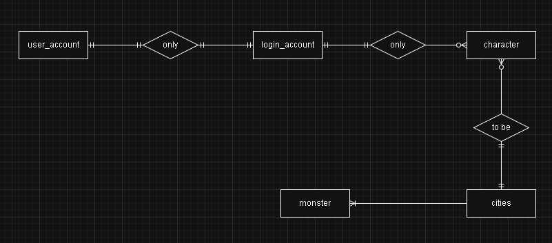
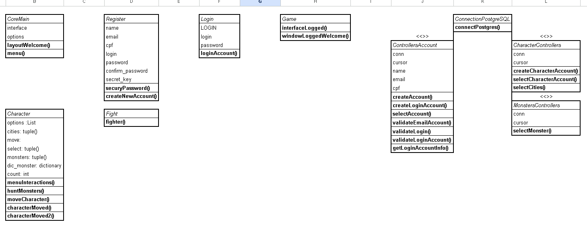

# Criar ambiente virtual
*python3 -m venv 'my_project_venv ou venv ou qualquer coisa'*
*source /home/crafael/Projects/rpg/venv/bin/activate* <- [Ativar ambiente virtual]
*pip freeze* <- [Verifca libs]

# Para installar todas as libs
*pip install -r requirements.txt*

# Enviar versão das libs para requirements
*pip freeze > requirements.txt*

# Para importar arquivos a partir da raiz do projeto
*obsoluct_path = os.path.abspath(os.curdir)*
*sys.path.insert(0, obsoluct_path)*

# Envio um comando para limpar o terminal
*os.system('cls' if os.name == 'nt' else 'clear')*

# Modelagem

# Diagrama de classe
